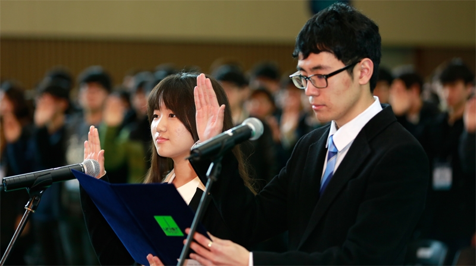

2015 - Present  
__B.S.__ in Electrical and Computer Engineering  
[__UNIST__(Ulsan National Institute of Science and Technology)](http://www.unist.ac.kr/), Ulsan, Korea, entered with top honors

 
 
2013 - 2015 
Gyeongsan Science High School, Gyeongsan, Korea, early graduated with certificate from president of UNIST (유니스트 총장상) 

