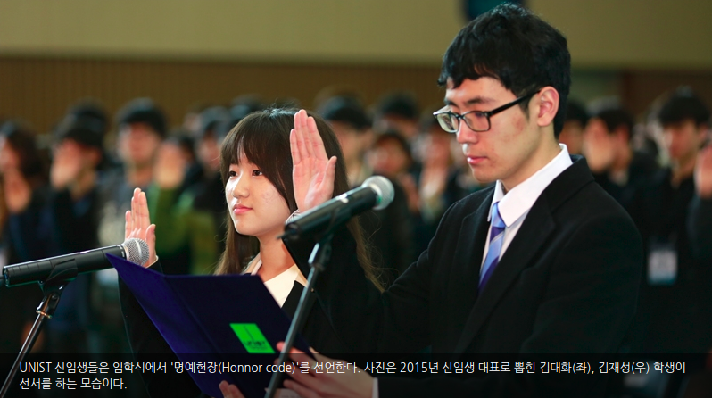

2015 - Present  
__B.S. in Electrical and Computer Engineering__  
[__UNIST__](http://www.unist.ac.kr/)__(Ulsan National Institute of Science and Technology)__, Ulsan, Korea, entered with top honors

 
 
2013 - 2015 
__Gyeongsan Science High School__, Gyeongsan, Korea, early graduated with certificate from president of UNIST (유니스트 총장상) 

